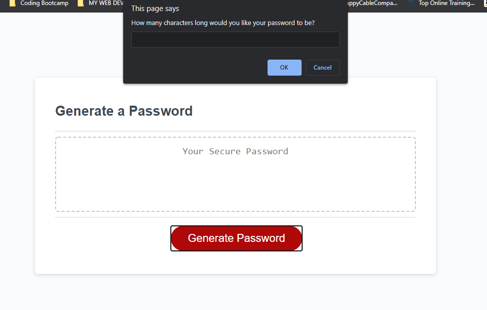

# Javascript Password Generator


    

## Description
This is a password generator utilizing Javascript! The application will prompt the user to choose between 8-128 characters for a password. The application will then ask if the user would like to use UPPERCASE characters in their randomly password. The application will also ask if the user would like to use LOWERCASE characters in their randomly generated password. Finally, the application will ask if the User would like to utilize SPECIAL characters in their randomly generated password.

The application will randomly generate a password based off the 3 choices at random. 

## Installation
To clone this to your repository, please use 
```
SSH: git clone git@github.com:d606n6k/william-portfolio.git
```
```
HTTPS: git clone https://github.com/d606n6k/william-portfolio.git
```
```
GitHub CLI: gh repo clone d606n6k/william-portfolio
```

## Usage
Press the "Generate Password" button to start the passwword generation. 


## Credits
Author: William A. Lucht

## License
You may only utilize code written in this repository with full accredidation to the author.

